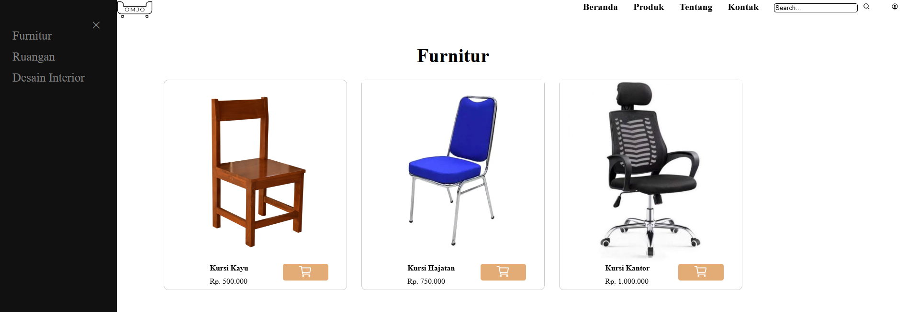
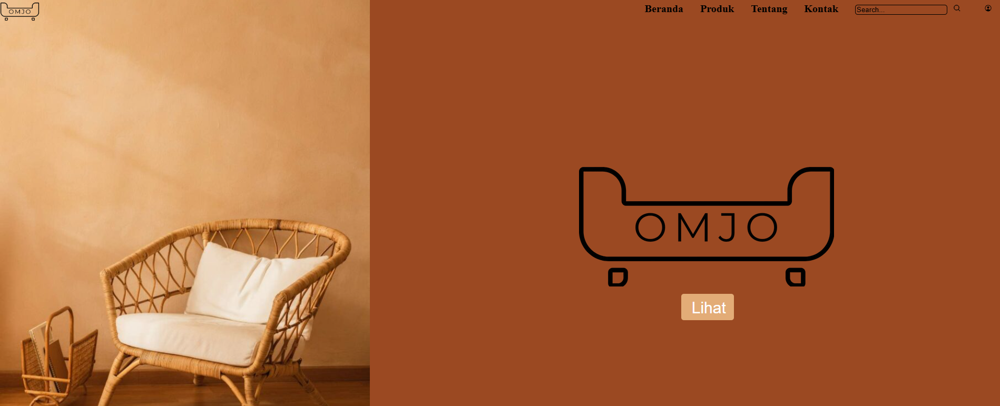

# Aplikasi OMJO

### Description:
**OMJO** merupakan aplikasi yang didesain sebagai marketplace khusus untuk kebutuhan dan keperluan furnitur dan juga desain interior.

Tujuan dari pembuatan aplikasi **OMJO** adalah untuk memudahkan orang-orang yang ingin mencari furnitur untuk memenuhi interior sesuai dengan kebutuhannya.

**OMJO** juga meneyediakan layanan desain interior untuk memudahkan pengguna dalam memilih konsep ataupun tema yang ingin diterapkan oleh pengguna. Layanan ini bertujuan untuk memberikan opsi bagaimana ruangan yang akan didesain beserta furnitur didalamnya sesuai dengan keinginan konsumen.

### Requirement:
Berikut beberapa hal yang diperlukan untuk menggunakan aplikasi **OMJO**:
- Koneksi Internet
- Browser (disarankan dibuka dengan **Chrome** menggunakan mode desktop)

### Installation (Guide)
>- Pastikan device yang anda gunakan sudah terhubung dengan internet
>- Pastikan anda memiliki link akses website **OMJO**
>- Ketikan link akses tersebut pada browser yang anda gunakan
>- Anda dapat login mengunakan username dan password yang anda miliki

>- Anda dapat menggunakan aplikasi **OMJO** untuk berbelanja kebutuhan furnitur Anda. Anda juga dapat melakukan konsultasi mengenai desain interior

>- Untuk berbelanja Anda dapat memasukkan barang yang Anda inginkan kedalam keranjang
>- Barang yang berada pada keranjang kemudian dapat di checkout, **pastikan barang dan detail pengiriman yang Anda ingin checkout sudah sesuai!**
>- Pilihlah metode pembayaran yang sesuai
>- Setelah melakukan pembayaran Anda dapat melacak barang Anda pada menu pesanan

Anda dapat mengakses link desain aplikasi **OMJO** pada:
[Click Here](omjo.com)

#### Documentation

-Tampilan Beranda

